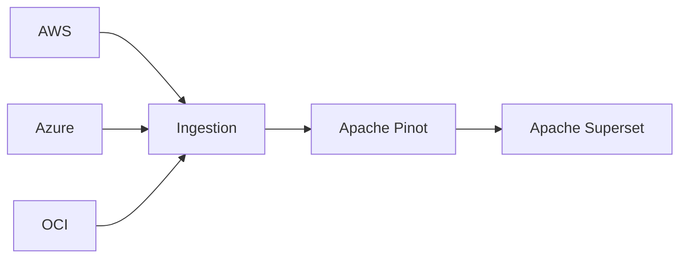

# FinOps FOCUS Dashboards and Charts with Apache Superset and Apache Pinot


The easy guide to create and operate your FinOps dashboards using [FOCUS™](https://focus.finops.org/), [Apache Pinot™](https://pinot.apache.org/) and [Apache Superset™](https://superset.apache.org/).


A FinOps and FOCUS guide by [Alexandre PARÈS, a FinOps Certified Professional](https://www.linkedin.com/in/alexandre-pares/).

## What is FOCUS™?
The FinOps Cost and Usage Specification (FOCUS™) is an open-source specification that defines clear requirements for cloud vendors to produce consistent cost and usage datasets.

Supported by the FinOps Foundation, FOCUS™ aims to reduce complexity for FinOps Practitioners so they can drive data-driven decision-making and maximize the business value of cloud, while making their skills more transferable across clouds, tools, and organizations.

Learn more about FOCUS in [this FinOps Foundation Insights article](https://www.finops.org/insights/focus-1-0-available/).

## What is Apache Superset™?
Superset is a modern data exploration and data visualization platform. Superset can replace or augment proprietary business intelligence tools for many teams. Superset integrates well with a variety of data sources.

Learn more about Apache Superset in [the Apache Superset Docs](https://superset.apache.org/docs/intro).

## What is Apache Pinot™?
Originally developed at LinkedIn, Apache PinotTM is a real-time distributed OLAP datastore, purpose-built to provide ultra low-latency analytics at extremely high throughput.

With its distributed architecture and columnar storage, Apache Pinot empowers businesses to gain valuable insights from real-time data, supporting data-driven decision-making and applications.

Learn more about Apache Pinot in [the Apache Pinot Docs](https://docs.pinot.apache.org/).

## Architecture diagram



## Installation Guide

### 1. Download FOCUS exports

For each of your Cloud Service Provider, you will need to configure a FOCUS export (not covered by this tutorial).
Once the export is setup and running you can download focus exports files.
We recommend to sync periodically your downloaded files with up to date focus exports.

For each of your Cloud Service Provider, you will need to configure a FOCUS export (not covered by this tutorial).
Once the export is setup and running you can download focus exports files.
We recommend to sync periodically your downloaded files with up to date focus exports.

You can use the following script [`./scripts/download_focus_export.sh`](./scripts/download_focus_export.sh) to download your exports.

Examples:
- AWS
```bash
# Download AWS FOCUS exports files
./scripts/download_focus_export.sh \
    -p aws \
    -b bucket_name \
    -e export_name \
    -d export/directory \
    -o ./exports/aws/
```
- Azure
```bash
# Download Azure FOCUS exports files
./scripts/download_focus_export.sh \
    -p azure \
    -b storage_account_name \
    -c container_name \
    -e export_name \
    -d export/directory \
    -o ./exports/azure/
```
- OCI
```bash
# Download OCI FOCUS exports files
./scripts/download_focus_export.sh \
    -p oci \
    -b bucket_name \
    -o ./exports/oci/
```

> todo
- [ ] Publish download_focus_export.sh script

### 2. Import FOCUS exports to Apache Pinot

Once FOCUS exports are downloaded and stored in the `./exports` directory we can import them to Apache Pinot.

But first we need to initialize our Apache Pinot with FOCUS Schema and Table config for each Cloud Service Provider.

To start the Apache Pinot stack in development we use Docker Compose, config is stored in [`compose.yaml`](./compose.yaml) file.

```bash
# We start all services (Apache Pinot + Apache Superset)
docker compose up -d

# To stop you can use this command
docker compose down
```

Once the stack is running, we can run the [`init-pinot.sh`](./init-pinot.sh) script to config and populate our Pinot Cluster with FOCUS Schemas and FOCUS Tables for each Cloud Service Provider.

This script will also import FOCUS exports to Apache Pinot.

> todo:

- [ ] Publish schemas for AWS, Azure, OCI and the blended table
- [ ] Publish table configs for AWS, Azure, OCI and the blended table
- [ ] Publish compose.yaml file
- [ ] Publish init-pinot.sh script
- [ ] Publish Spark ingestion jobs for AWS, Azure and OCI

### 3. Launch and configure Apache Superset

Add the Apache Pinot database to Apache Superset:

```bash
pip install pinotdb
```

> todo


# Disclaimer

Apache Superset, Superset, Apache Pinot, Pinot, Apache, the Superset logo, the Apache Pinot project logo and the Apache feather logo are either registered trademarks or trademarks of The Apache Software Foundation. All other products or name brands are trademarks of their respective holders, including The Apache Software Foundation. [Apache Software Foundation](https://www.apache.org/) resources

FOCUS™, is either registered trademarks or trademarks of The Joint Development Foundation. All other products or name brands are trademarks of their respective holders, including The Joint Development Foundation. [Joint Development Foundation](https://jointdevelopment.org/) resources

DuckDB, the DuckDB logo are either registered trademarks or trademarks of The DuckDB Foundation. All other products or name brands are trademarks of their respective holders, including The DuckDB Foundation. [DuckDB Foundation](https://duckdb.org/) resources
