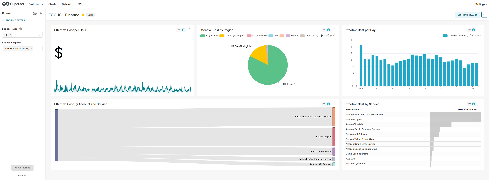

# FinOps FOCUS Dashboards and Charts with Apache Superset and Apache Pinot



The easy guide to create and operate your FinOps dashboards using [FOCUS™](https://focus.finops.org/), [Apache Pinot™](https://pinot.apache.org/) and [Apache Superset™](https://superset.apache.org/).


A FinOps and FOCUS guide by [Alexandre PARÈS, a FinOps Certified Professional](https://www.linkedin.com/in/alexandre-pares/).

## What is FOCUS™?
The FinOps Cost and Usage Specification (FOCUS™) is an open-source specification that defines clear requirements for cloud vendors to produce consistent cost and usage datasets.

Supported by the FinOps Foundation, FOCUS™ aims to reduce complexity for FinOps Practitioners so they can drive data-driven decision-making and maximize the business value of cloud, while making their skills more transferable across clouds, tools, and organizations.

Learn more about FOCUS in [this FinOps Foundation Insights article](https://www.finops.org/insights/focus-1-0-available/).

## What is Apache Superset™?
Superset is a modern data exploration and data visualization platform. Superset can replace or augment proprietary business intelligence tools for many teams. Superset integrates well with a variety of data sources.

Learn more about Apache Superset in [the Apache Superset Docs](https://superset.apache.org/docs/intro).

## What is Apache Pinot™?
Originally developed at LinkedIn, Apache PinotTM is a real-time distributed OLAP datastore, purpose-built to provide ultra low-latency analytics at extremely high throughput.

With its distributed architecture and columnar storage, Apache Pinot empowers businesses to gain valuable insights from real-time data, supporting data-driven decision-making and applications.

Learn more about Apache Pinot in [the Apache Pinot Docs](https://docs.pinot.apache.org/).

## Architecture diagram

> todo

## Installation Guide

> todo

### 1. Download FOCUS exports from AWS bucket

Let's assume you have created a FOCUS export to the `finops-exports-1a2b3c4d` s3 bucket using the [`billing-export`](https://registry.terraform.io/modules/IAmFrench/billing-export/aws/latest) Terraform module for AWS.

This bucket has the folling structure:
```bash
# Set the Name of the bucket where AWS FOCUS v1.0-preview exports are
export AWS_FOCUS_EXPORT_BUCKET="finops-exports-1a2b3c4d"
export AWS_EXPORT_S3_PREFIX="focus/123456789"

# List all objects in the s3 bucket
aws s3 ls s3://${AWS_FOCUS_EXPORT_BUCKET}/${AWS_EXPORT_S3_PREFIX}/ --recursive --summarize --human-readable

2024-07-06 05:00:09   56.2 MiB focus-1-0-preview-export/data/BILLING_PERIOD=2024-06/focus-1-0-preview-export-00001.snappy.parquet
2024-07-06 05:00:09   56.1 MiB focus-1-0-preview-export/data/BILLING_PERIOD=2024-06/focus-1-0-preview-export-00002.snappy.parquet
2024-07-06 05:00:09   56.0 MiB focus-1-0-preview-export/data/BILLING_PERIOD=2024-06/focus-1-0-preview-export-00003.snappy.parquet
2024-07-27 11:53:52   47.7 MiB focus-1-0-preview-export/data/BILLING_PERIOD=2024-07/focus-1-0-preview-export-00001.snappy.parquet
2024-07-27 11:53:52   47.6 MiB focus-1-0-preview-export/data/BILLING_PERIOD=2024-07/focus-1-0-preview-export-00002.snappy.parquet
2024-07-27 11:53:52   47.7 MiB focus-1-0-preview-export/data/BILLING_PERIOD=2024-07/focus-1-0-preview-export-00003.snappy.parquet
2024-07-06 05:00:29    2.6 KiB focus-1-0-preview-export/metadata/BILLING_PERIOD=2024-06/focus-1-0-preview-export-Manifest.json
2024-07-27 11:54:02    2.6 KiB focus-1-0-preview-export/metadata/BILLING_PERIOD=2024-07/focus-1-0-preview-export-Manifest.json

Total Objects: 8
Total Size: 311.3 MiB
```

We can copy all `.parquet` files into a `/exports` folder locally:

```bash
# Name of the export
export AWS_EXPORT_NAME="focus-1-0-preview-export"

# Clone the folder data that contains .parquet files to a local exports folder
aws s3 cp s3://${AWS_FOCUS_EXPORT_BUCKET}/${AWS_EXPORT_S3_PREFIX}/${AWS_EXPORT_NAME}/data/ ./exports --recursive
```

We should have this structure in our local `./exports` folder:

```bash
du -a ./exports

57588   ./exports/BILLING_PERIOD=2024-06/focus-1-0-preview-export-00001.snappy.parquet
57412   ./exports/BILLING_PERIOD=2024-06/focus-1-0-preview-export-00002.snappy.parquet
57316   ./exports/BILLING_PERIOD=2024-06/focus-1-0-preview-export-00003.snappy.parquet
172316  ./exports/BILLING_PERIOD=2024-06
47356   ./exports/BILLING_PERIOD=2024-07/focus-1-0-preview-export-00001.snappy.parquet
47372   ./exports/BILLING_PERIOD=2024-07/focus-1-0-preview-export-00002.snappy.parquet
47524   ./exports/BILLING_PERIOD=2024-07/focus-1-0-preview-export-00003.snappy.parquet
142252  ./exports/BILLING_PERIOD=2024-07
314568  ./exports/
```


# Disclaimer

Apache Superset, Superset, Apache Pinot, Pinot, Apache, the Superset logo, the Apache Pinot project logo and the Apache feather logo are either registered trademarks or trademarks of The Apache Software Foundation. All other products or name brands are trademarks of their respective holders, including The Apache Software Foundation. [Apache Software Foundation](https://www.apache.org/) resources

FOCUS™, is either registered trademarks or trademarks of The Joint Development Foundation. All other products or name brands are trademarks of their respective holders, including The Joint Development Foundation. [Joint Development Foundation](https://jointdevelopment.org/) resources
